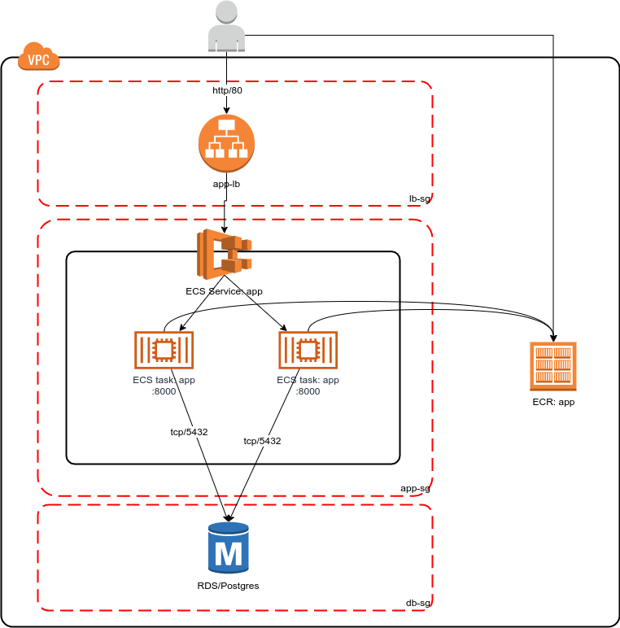

# AWS ECS PoC

This repository contains a proof-of-concept of fully scripted and automated
no-downtime deployment of a dockerized application which
exposes a small HTTP-based API.

## Stack:

- AWS: ECS/EC2, ECR, RDS/Postgres, S3, VPC, ELB
- Docker
- Terraform
- Python/Flask

## API endpoint description

```
Description: Saves/updates the given user’s name and date of birth in the database.  
Request: PUT /hello/<username> { “dateOfBirth”: “YYYY-MM-DD” }  
Response: 204 No Content  
```

**Note:**

- <username> must contain only letters. 
- YYYY-MM-DD must be a date before the today date. 

```
Description: Returns hello birthday message for the given user 
Request: Get /hello/<username> 
Response: 200 OK 
```

**Response Examples: **

A. If username’s birthday is in N days: 
```
{ “message”: “Hello, <username>! Your birthday is in N day(s)” 
} 
```

B. If username’s birthday is today: 
```
{ “message”: “Hello, <username>! Happy birthday!” }  
```

## Deployment diagram:




## File structure

```
.
├── aws.sh.example  | Environment variables with AWS credentials and settings
├── helloapp        | Python/Flask application
├── README.md       | This file
└── terraform       | Terraform code used to provision AWS environment

2 directories, 2 files
```

## Usage

### Prerequisites

- AWS account (note it's ID) with access and secret keys created. Eu-west-1 region is supposed to be used

- Machine with Linux (tested on Ubuntu 18.04) and Docker

- Terraform 0.12.6 and Python 3.6 installed

### Workflow

#### Local development

0. Test application:

        cd helloapp
        make initestenv
        make test

0. Run application locally:

        cd helloapp
        make initenv
        make initdb
        make rundev

0. Build docker image:

        make init
        make build

### First deployment to AWS

0. Make sure that docker image was built locally:

        docker image list | grep app

0. Make sure that all necessary environment variables are set (see "aws.sh.example").

0. Provision infrastructure (and ECR repository):

        cd terraform
        terraform init
        terraform apply

        #Load ballancer URL should be returned as the result of successful apply. Note it down.

0. Push docker image to ECR:

        cd ../helloapp
        make auth
        make push

0. Wait a few moments, app should go up.

0. Test it out:
  
        curl -XPUT -H 'Content-Type: application/json' app-lb-282189655.eu-west-1.elb.amazonaws.com/hello/Gennadiy -d '{"dateOfBirth": "1990-01-30"}'

        curl -XGET -H 'Content-Type: application/json' app-lb-282189655.eu-west-1.elb.amazonaws.com/hello/Gennadiy

### Re-deployment (update)

0. Make sure that env variables are set (see aws.sh.example)
0. Run:

        cd helloapp
        make test
        make build
        # if needed: make auth
        make deploy
